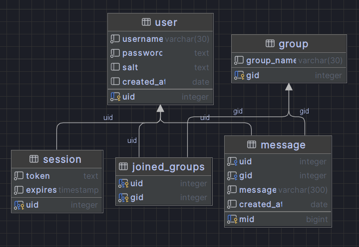

# Database Design Document

## Tables

List of all tables:

- User
  - uid PK
  - username
  - password (Hashed + Salted)
  - Salt
  - created at
- Group
  - gid PK
  - name
  - owner
- Messages
  - mid PK 
  - uid 
  - gid 
  - message (HTML removed)
  - date sent
- Joined Groups
  - uid FK PK
  - gid FK PK
- Session
  - uid FK PK
  - token
  - expire

## TODO: Update sql and graph


```postgresql
create sequence uer_uid_seq
    as integer;

alter sequence uer_uid_seq owner to "chat-project";

create table "group"
(
    gid        serial
        constraint group_pk
            primary key,
    group_name varchar(30) not null
);

alter table "group"
    owner to "chat-project";

create table "user"
(
    uid        integer default nextval('uer_uid_seq'::regclass) not null
        constraint user_pk
            primary key,
    username   varchar(30)                                      not null,
    password   text                                             not null,
    salt       text,
    created_at date    default now()
);

alter table "user"
    owner to "chat-project";

alter sequence uer_uid_seq owned by "user".uid;

create table message
(
    mid        bigserial
        constraint message_pk
            primary key,
    uid        integer            not null
        constraint message__fk___uid
            references "user",
    gid        integer            not null
        constraint message___fk___gid
            references "group",
    message    varchar(300)       not null,
    created_at date default now() not null
);

alter table message
    owner to "chat-project";

create table joined_groups
(
    uid integer not null
        constraint joined_groups___fk___uid
            references "user",
    gid integer not null
        constraint joined_groups___fk___gid
            references "group",
    constraint joined_groups_pk
        primary key (uid, gid)
);

alter table joined_groups
    owner to "chat-project";

create table session
(
    uid     integer                 not null
        constraint session_pk
            primary key
        constraint session___fk___uid
            references "user",
    token   text                    not null,
    expires timestamp default now() not null
);

alter table session
    owner to "chat-project";
```